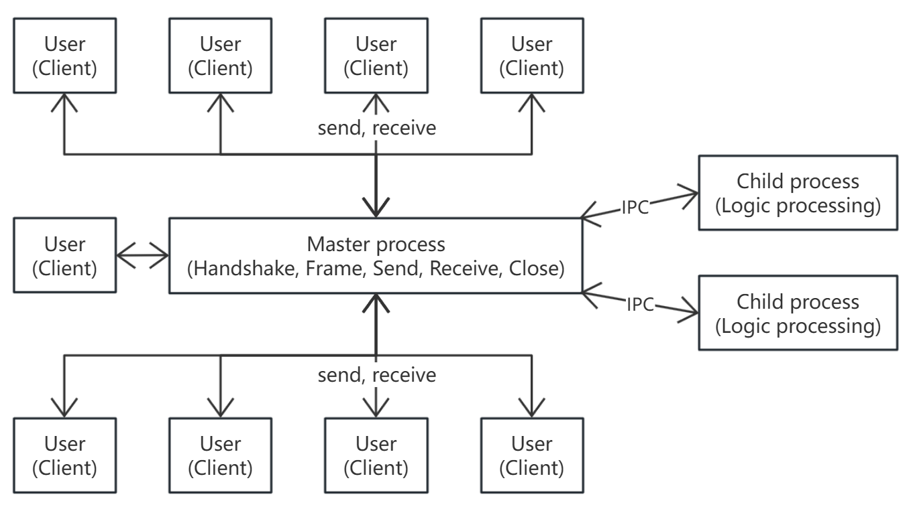
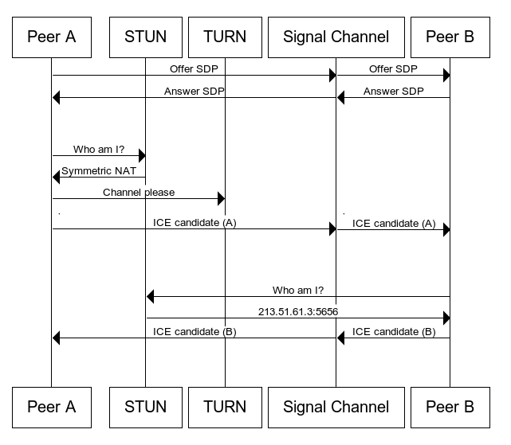

## 简介
WebSocket 聊天室，基于原生PHP和libevent

## 目录结构
```
chat
├── docker              Docker相关配置
│   ├── conf
│   │   ├── nginx       nginx网站配置.conf
│   │   └── php         PHP运行配置.ini
│   └── source          扩展包
├── html                HTML页面
│   ├── dist            编译目录
│   ├── public
│   └── src
│   └── tests
├── php             PHP服务脚本
│   ├── logs        日志目录
│   ├── server      WsServer目录
│   └── upload      文件上传目录
└── ssl             证书目录
```

## 后端
### 运行流程图


### 安装
#### Docker安装
1. 修改默认docker配置 `docker/docker-compose.yml` 中的目录映射
2. 修改默认网站配置 `docker/conf/nginx/www.conf`
3. 创建目录（保存Redis快照） `mkdir /home/chat/data`
4. 创建目录（保存上传文件） `mkdir /home/chat/php/upload`
5. 启动服务 `docker-compose up`
6. 编译前端，浏览器访问 http://xxx/index.html

#### 常规安装
1. 环境要求：Redis 2.6+、PHP 7.2+、libevent-dev、Apache/nginx
2. 安装扩展 `pecl install msgpack redis event` 并添加到 `php.ini` 中
3. 启动服务 `php Client.php -d -p 8080 -n 8`
4. 编译前端，浏览器访问 http://xxx/index.html

#### 证书[可选]
##### 证书格式转换

参考：https://stackoverflow.com/questions/642284/do-i-need-to-convert-cer-to-crt-for-apache-ssl-certificates-if-so-how
```
openssl x509 -inform DER -in certificate.cer -out certificate.crt
openssl x509 -inform PEM -in certificate.cer -out certificate.crt
```

##### PHP [wss服务器]
1. 创建目录`mkdir /home/chat/ssl`，并将证书放于`ssl`目录中
2. 创建PHP项目配置`php/local.ini`，示例（xxx替换为域名）：
```
[ssl]
local_cert=/home/ssl/xxx.crt
local_pk=/home/ssl/xxx.key
verify_peer=false
```

##### nginx [https服务器]
1. 修改nginx配置`docker/conf/nginx/www.conf`的server段，示例（xxx替换为域名）：
```
listen              443 ssl;
server_name         xxx;
ssl_protocols       TLSv1.2 TLSv1.3;
ssl_ciphers         AES128-SHA:AES256-SHA:RC4-SHA:DES-CBC3-SHA:RC4-MD5;
ssl_certificate     /etc/nginx/ssl/xxx.crt;
ssl_certificate_key /etc/nginx/ssl/xxx.key;
ssl_session_cache   shared:SSL:10m;
ssl_session_timeout 10m;
```

##### docker-compose
1. 修改`docker-compose.yml`中的目录映射，示例：
```
nginx:
  volumes:
    - /home/chat/ssl:/etc/nginx/ssl

php:
  volumes:
    - /home/chat/ssl:/home/ssl
```
2. 重启docker `docker-compose restart`
3. 浏览器访问 https://xxx/index.html

#### PHP启动参数说明
1. -d 后台运行
2. -p port 监听端口号
3. -n num 开启的子进程数，至少为1

## 前端(新版)
### 框架/插件
1. 框架 [Vue 2](https://v2.cn.vuejs.org/)
2. 主界面 [lemon-imui](https://www.npmjs.com/package/lemon-imui)
3. 登录框 [vue-js-modal](https://www.npmjs.com/package/vue-js-modal)
4. 数据压缩 [msgpackr](https://www.npmjs.com/package/msgpackr)
5. JS编译器 [Babel](https://babel.nodejs.cn/docs/)
6. 提示框 [vue-notification](https://www.npmjs.com/package/vue-notification)
7. 图片预览 [v-viewer@legacy](https://github.com/mirari/v-viewer/tree/v2)
8. 头像裁剪 [vue-image-crop-upload](https://www.npmjs.com/package/vue-image-crop-upload)
9. 图标库 [weui-icon](https://github.com/weui/weui-icon)

### 安装/开发
#### 本地http访问
1. 创建`.env.local`环境配置文件
2. 设置环境变量（WebSocket服务器地址和文件服务器地址），示例：
```
VUE_APP_SERVER_URL=ws://192.168.1.10:8080
VUE_APP_UPLOAD_URL=http://192.168.1.10
```
3. 安装，运行
```
npm install
npm run serve
```
4. 浏览器访问 http://localhost:8080/index.html

#### 本地https访问[可选]
1. 将证书文件放在某个文件夹下
2. 修改`.env.local`环境变量，示例（xxx替换为域名）：
```
VUE_APP_SERVER_URL=wss://xxx:8080
VUE_APP_UPLOAD_URL=https://xxx
SSL_CERT=../ssl/xxx.crt
SSL_KEY=../ssl/xxx.key
```
3. 运行，示例（可能需要修改hosts）：
```
npm run serve -- --port 443 --host xxx
```
4. 浏览器访问 https://xxx.com/index.html

### 编译/部署
1. 创建`.env.production`环境配置文件
2. 设置环境变量
```
VUE_APP_SERVER_URL=ws://xxx:8080 or wss://xxx:8080
VUE_APP_UPLOAD_URL=http://xxx or https://xxx
```
3. 编译 `npm run build`
4. 将`dist`目录中的文件上传至服务器nginx相应目录下
5. 浏览器访问 http://xxx/index.html

## 视频聊天
通过WebRTC协议实现

### 流程图
详见 [Signaling and video calling](https://developer.mozilla.org/en-US/docs/Web/API/WebRTC_API/Signaling_and_video_calling)




### 多人视频流程描述
```
(Server: S, caller: A, callee: B C D)
A ->open media
   -> request S to CREATE room[members] and ask all
        B received -> accept
                    -> open media
                     -> create new RTCPeerConnection
                      -> setLocalDescription (triggers onicecandidate -> send RTCIceCandidate to A)
                       -> send offerB to A (through S)
                        -> request S to JOIN room
        C received -> accept
                    -> open media
                     -> create new RTCPeerConnection
                      -> setLocalDescription (triggers onicecandidate -> send RTCIceCandidate to A)
                       -> send offerC to A (through S)
                        -> request S to JOIN room
        D received -> deny

A -> received offerB
   -> create new RTCPeerConnection
    -> setRemoteDescription(offerB) and addIceCandidate
     -> setLocalDescription (triggers onicecandidate -> send RTCIceCandidate to B)
      -> send answerA to B
  -> received offerC
   -> create new RTCPeerConnection
    -> setRemoteDescription(offerC) and addIceCandidate
     -> setLocalDescription (triggers onicecandidate -> send RTCIceCandidate to C)
      -> send answerA to C

B -> received answerA
   -> setRemoteDescription(answerA) and addIceCandidate
    -> (B-A connected)
  
C -> received answerA
   -> setRemoteDescription(answerA) and addIceCandidate
    -> (C-A connected)

S -> received B JOIN request
   -> send to members(except B and A), but only A and B in room, so do nothing
  -> received C JOIN request
   -> send to members(except C and A), so send JOIN to B

B -> received C JOIN request
   -> create new RTCPeerConnection
    -> setLocalDescription (triggers onicecandidate -> send RTCIceCandidate to C)
     -> send offerB to C (through S)

C -> received offerB
   -> create new RTCPeerConnection
    -> setRemoteDescription(offerB) and addIceCandidate
     -> setLocalDescription (triggers onicecandidate -> send RTCIceCandidate to B)
      -> send answerC to B

B -> received answerC
   -> setRemoteDescription(answerC) and addIceCandidate
    -> (B-C connected)
```

### WebRTC
1. 网站须以https和wss协议访问
2. 公网需要TURN(Traversal Using Relays around NAT) Server中转多媒体数据
3. 默认使用公网免费的TURN Server，详情访问 https://freestun.net/
4. 若需要私有服务器，则：
* 搭建TURN Server，详情访问 https://github.com/coturn/coturn/
* 修改 `webrtc.js` 中的 `iceServers` 配置
* 测试服务器是否可用 https://icetest.atec-systems.com/
  > 注：TURN Server需要大量带宽


## 支持的浏览器
1. Chrome
2. Firefox
3. Edge
4. Opera
5. ...

## 待办
- [ ] 界面交互优化

## 相关链接
[pecl-event](https://bitbucket.org/osmanov/pecl-event)
[msgpack](https://github.com/msgpack/msgpack-php)
[phpredis](https://github.com/phpredis/phpredis/)